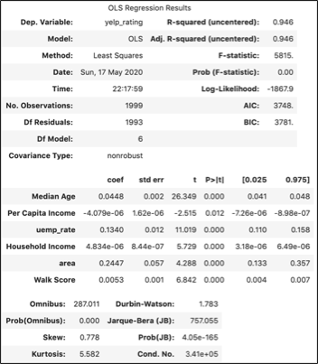
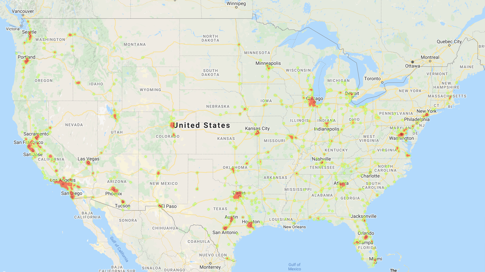
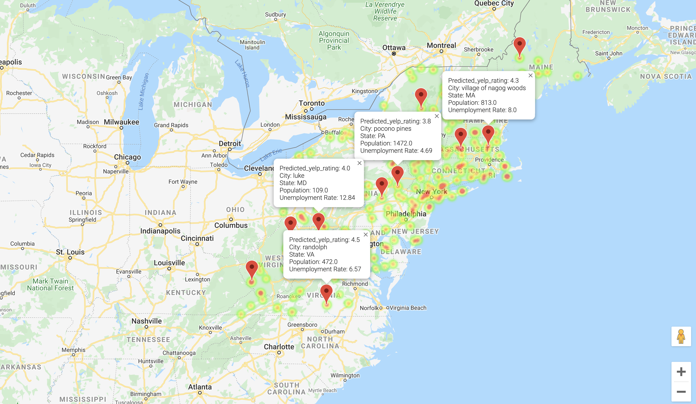

# Panda Express Restaurant Analysis
#### Team Members: Andy Kwon, Chris Cho, Peter Smith, Yang Sun

## Project Question: 
#### Where should Panda Express open its new locations based on high Yelp ratings?

## Project Goal: 
#### Increase Panda Express brand awareness and perception.

## Data Source
* Panda Express Locations
* Census API
* Yelp API
* Google Places API
* Walk Score API

## Analysis
* Outlier detection
* Relationship between variables
* Logistic Regression
* Linear Regression

## Summary:
* Linear Regression Summary:

* Existing Panda Express yelp rating heatmap

* Predicted yelp rating graph

